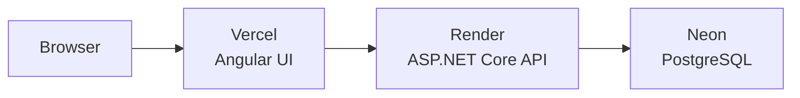

# Current

A full-stack personal finance platform built with Angular and ASP.NET Core.

## Tech stack

[](https://angular.dev/)
[](https://dotnet.microsoft.com/)
[](https://www.postgresql.org/)
[](https://www.docker.com/)
[](https://github.com/features/actions)

## Deployment

Production runs as three managed services; local dev uses Homebrew Postgres (or Docker).

[](https://vercel.com/)
[](https://render.com/)
[](https://neon.tech/)



| Environment | UI | API | Database |
|-------------|----|-----|----------|
| **Production** | [Vercel](https://vercel.com/) — `frontend/current-ui` | [Render](https://render.com/) — Docker | [Neon](https://neon.tech/) |
| **Local dev** | `make ui` → localhost:4200 | `make dev` → localhost:5231 | Homebrew Postgres (`CurrentDb`) |
| **Local Docker** | `make docker-up` → localhost:4200 | same stack | Postgres container |

Production API: `https://current-zdw5.onrender.com`

See [Deployment Guide](docs/DEPLOYMENT.md) for Neon, Render, and Vercel setup. After deploying the UI, add your Vercel URL to API CORS in `CorsExtensions.cs`.

## Structure

- `backend/` — ASP.NET Core API
- `frontend/current-ui/` — Angular app (`current-ui`)
- `brand/` — Logo source files
- `database/` — SQL scripts and seeds
- `docs/` — Project documentation

## Status

**Phase 12 (DevOps):** Docker, CI/CD, Neon, and Render API — complete. Vercel UI — in progress.

See [Release Log](docs/RELEASE_LOG.md) for full phase-by-phase progress.

## Prerequisites

- [.NET 10 SDK](https://dotnet.microsoft.com/download)
- [Node.js 20+](https://nodejs.org/) (Angular CLI via `npm` in `frontend/current-ui`)
- [PostgreSQL 17](https://formulae.brew.sh/formula/postgresql@17) via Homebrew

```bash
brew install postgresql@17
```

Add Postgres to your PATH (add to `~/.zshrc`):

```bash
export PATH="/opt/homebrew/opt/postgresql@17/bin:$PATH"
```

Update `backend/Current.Api/appsettings.Development.json` if your macOS username is not `nikhil`.

## Quick start

From the project root:

```bash
make dev
```

This will:

1. Start PostgreSQL (if not running)
2. Create `CurrentDb` (if it doesn't exist)
3. Apply EF Core migrations
4. Run the API with hot reload

API: http://localhost:5231  
Swagger: http://localhost:5231/swagger

Protected endpoints require a JWT. In Swagger: `POST /auth/login` → copy `token` → **Authorize** → `Bearer <token>`.

### Frontend (Phase 4)

From the project root:

```bash
make ui
```

UI: http://localhost:4200

Install dependencies first (once):

```bash
cd frontend/current-ui && npm install
```

### Other commands

| Command | Description |
|---------|-------------|
| `make api` | Run API only (assumes DB is up) |
| `make db-up` | Start Postgres and create database |
| `make db-down` | Stop Postgres background service |
| `make migrate` | Apply pending EF migrations |
| `make build` | Build the API |
| `make ui` | Run Angular dev server |
| `make build-ui` | Build Angular app |
| `make test` | Run backend integration tests |
| `make docker-up` | Build and start Postgres + API + UI (Docker) |
| `make docker-down` | Stop Docker stack |
| `make docker-logs` | Follow Docker container logs |

## Production database (Neon)

See [Deployment Guide](docs/DEPLOYMENT.md) for Neon setup. After creating a Neon project, run migrations:

```bash
export ConnectionStrings__DefaultConnection='your-neon-connection-string'
make migrate-neon
```

Do not commit real connection strings.

## CI

[](https://github.com/nikhilsurfingaus/Current/actions/workflows/build.yml)

Every push to `master` runs GitHub Actions: build API, run backend tests, build Angular.

## Docker

Run the full stack with one command (requires [Docker Desktop](https://www.docker.com/products/docker-desktop/)):

```bash
make docker-up
```

| Service | URL |
|---------|-----|
| UI | http://localhost:4200 |
| API | http://localhost:5231 |
| Swagger | http://localhost:5231/swagger |

Optional: copy `.env.example` to `.env` to override JWT and ports. Defaults are fine for local Docker.

Stop the stack:

```bash
make docker-down
```


### Phase 1

| Method | Route | Auth | Description |
|--------|-------|------|-------------|
| GET | `/users/me` | Required | Current user profile |
| GET | `/users/{id}` | Required | Own profile only |
| GET | `/accounts` | Required | List own accounts |
| GET | `/accounts/{id}` | Required | Get own account by ID |
| POST | `/accounts` | Required | Create account for current user |

### Phase 2

| Method | Route | Auth | Description |
|--------|-------|------|-------------|
| POST | `/transactions/transfer` | Required | Transfer between own accounts |
| GET | `/transactions` | Required | List own transactions |
| GET | `/transactions/{id}` | Required | Get own transaction by ID |

### Phase 3

| Method | Route | Auth | Description |
|--------|-------|------|-------------|
| POST | `/auth/register` | Public | Register and receive JWT |
| POST | `/auth/login` | Public | Login and receive JWT |
