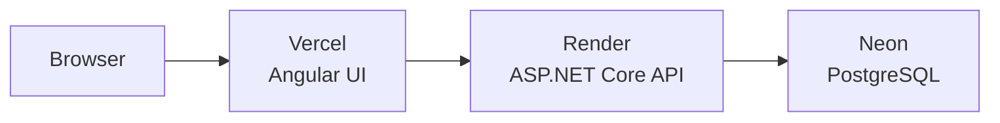

# Current

A full-stack personal finance platform — ledger-based accounts, transfers, payments, goals, analytics, loans, and notifications. Built with **Angular** and **ASP.NET Core**.

**Live app:** https://current-au.vercel.app  
**Demo login:** `demo@current.app` / `Demo123!` — see [Demo account](docs/DEMO.md) to set up in production.

## Features

- JWT authentication and per-user data isolation
- Double-entry ledger (transfers, payments, goal movements)
- Accounts with welcome credit on first account
- Pay someone by email with idempotent sends
- Savings goals with contribution history
- Analytics dashboard (cash flow, categories, net worth)
- Loan requests with admin approval workflow
- In-app notifications
- Mobile-responsive UI with dark/light theme
- Production deployment on Vercel + Render + Neon

## Tech stack

[](https://angular.dev/)
[](https://dotnet.microsoft.com/)
[](https://www.postgresql.org/)
[](https://www.docker.com/)
[](https://github.com/features/actions)

## Deployment



[](https://vercel.com/)
[](https://render.com/)
[](https://neon.tech/)

| Environment | UI | API |
|-------------|----|-----|
| **Production** | https://current-au.vercel.app | https://current-zdw5.onrender.com |
| **Local dev** | http://localhost:4200 | http://localhost:5231 |

## Documentation

| Doc | Description |
|-----|-------------|
| [Architecture](docs/ARCHITECTURE.md) | System design, layers, auth & transfer flows |
| [API](docs/API.md) | REST endpoints and auth |
| [ERD](docs/ERD.md) | Database entity relationships |
| [Deployment](docs/DEPLOYMENT.md) | Neon, Render, Vercel setup |
| [Demo account](docs/DEMO.md) | Shared login for reviewers |
| [Release log](docs/RELEASE_LOG.md) | Phase-by-phase build history |

## Project structure

```
Current/
├── backend/Current.Api          # ASP.NET Core API
├── backend/Current.Api.Tests      # Integration tests (41)
├── frontend/current-ui            # Angular SPA
├── database/scripts               # SQL helpers
├── docs/                          # Architecture, API, ERD, deployment
├── .github/workflows/build.yml    # CI
├── docker-compose.yml
└── Makefile
```

## Quick start (local)

**Prerequisites:** .NET 10 SDK, Node.js 20+, PostgreSQL 17 (Homebrew).

```bash
brew install postgresql@17
export PATH="/opt/homebrew/opt/postgresql@17/bin:$PATH"
```

```bash
# Terminal 1 — API
make dev

# Terminal 2 — UI (once: cd frontend/current-ui && npm install)
make ui
```

| Service | URL |
|---------|-----|
| UI | http://localhost:4200 |
| API | http://localhost:5231 |
| Swagger | http://localhost:5231/swagger |

Update `backend/Current.Api/appsettings.Development.json` if your Postgres username is not `nikhil`.

## Commands

| Command | Description |
|---------|-------------|
| `make dev` | Postgres + migrations + API (hot reload) |
| `make ui` | Angular dev server |
| `make test` | Run 41 backend integration tests |
| `make docker-up` | Full stack in Docker |
| `make migrate-neon` | Apply migrations to Neon (set connection string first) |

## Testing

[](https://github.com/nikhilsurfingaus/Current/actions/workflows/build.yml)

```bash
make test
```

CI runs on every push to `master`: API build, tests, Angular production build.

## Roadmap

- [x] Core ledger, auth, accounts, transfers
- [x] Payments, goals, analytics, contacts
- [x] Loans, branch treasury, notifications
- [x] Docker, CI/CD, cloud deployment
- [x] Serilog, health checks, production middleware
- [ ] v1.0.0 release tag

See [Release Log](docs/RELEASE_LOG.md) for full history.
