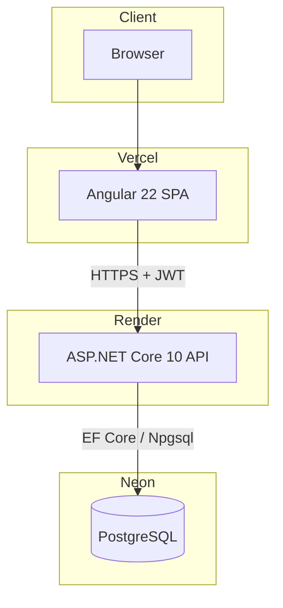
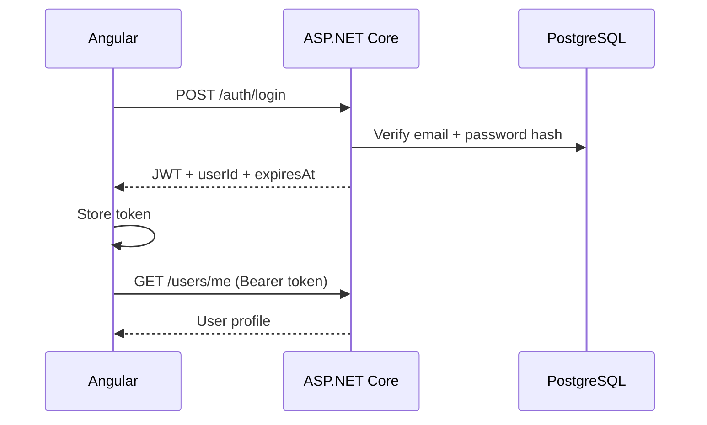
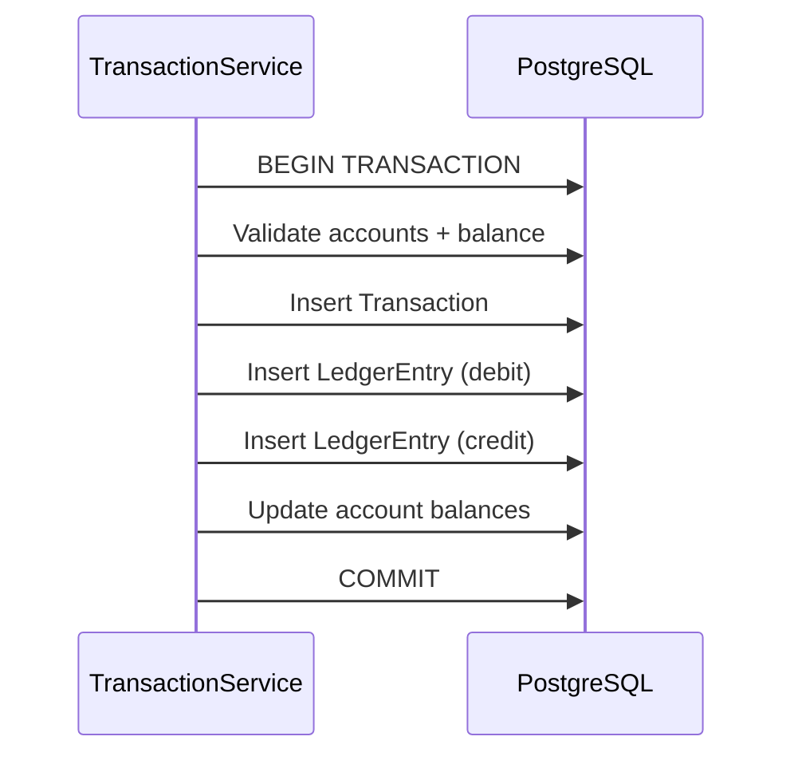

# Architecture

## Overview

**Current** is a ledger-based personal finance platform. Money movement is recorded as balanced debit/credit **ledger entries** inside database transactions — not by directly mutating balances without audit trail.

## Production topology



| Layer | Technology | Hosting |
|-------|------------|---------|
| Frontend | Angular 22, Chart.js, SCSS | Vercel |
| API | ASP.NET Core 10, JWT, Serilog | Render (Docker) |
| Database | PostgreSQL, EF Core migrations | Neon |
| CI | GitHub Actions | GitHub |
| Local full stack | Docker Compose | Developer machine |

**Live URLs**

- UI: https://current-au.vercel.app
- API: https://current-zdw5.onrender.com
- Health: `GET /health`

## Backend layers

```
Controllers     → HTTP, auth attributes, request/response DTOs
Services        → Business logic, transactions, validation
Data            → ApplicationDbContext, EF Core mappings
Entities        → Domain models
DTOs / Mappings → API contracts
Middleware      → Exception handling, security headers
Extensions      → CORS, Swagger, Serilog, health checks, DI wiring
```

### Key patterns

- **Dependency injection** — services registered in `ServiceCollectionExtensions`
- **Ownership enforcement** — users only access their own accounts, transactions, goals, loans
- **DB transactions** — transfers, payments, goal contributions, loan disbursements use explicit transactions
- **Double-entry ledger** — each transfer creates a `Transaction` plus matching debit/credit `LedgerEntry` rows
- **Idempotent payments** — `Idempotency-Key` header prevents duplicate sends
- **Branch treasury** — system branch holds float; welcome credit and loan disbursements debit treasury

## Frontend layers

```
features/     → Route-level pages (dashboard, accounts, payments, …)
core/         → Auth guard, interceptor, API service, models
layouts/      → Auth shell, main shell with sidebar / mobile drawer
elements/     → Shared styled components
```

- **JWT** stored client-side; `authInterceptor` attaches `Authorization: Bearer`
- **Route guards** — `authGuard`, `guestGuard`, `adminGuard`
- **Environments** — `environment.development.ts` (localhost API) vs `environment.ts` (Render API for production builds)

## Authentication flow



Registration: `POST /auth/register` returns the JWT and welcome notification (same shape as login).

## Financial core (transfer)



## Configuration

| Source | Used for |
|--------|----------|
| `appsettings.json` | Base defaults |
| `appsettings.Development.json` | Local `make dev` |
| `appsettings.Production.json` | Render (CORS origins, Serilog) |
| Environment variables | Secrets on Render (connection string, JWT key) |

See [Deployment Guide](DEPLOYMENT.md).

## Testing

- **41 integration tests** (`Current.Api.Tests`) using `WebApplicationFactory` + SQLite in-memory
- Covers auth, transfers, payments, loans, notifications
- Run: `make test`

## Related docs

- [API reference](API.md)
- [ER diagram](ERD.md)
- [Deployment](DEPLOYMENT.md)
- [Demo account](DEMO.md)
- [Release log](RELEASE_LOG.md)
