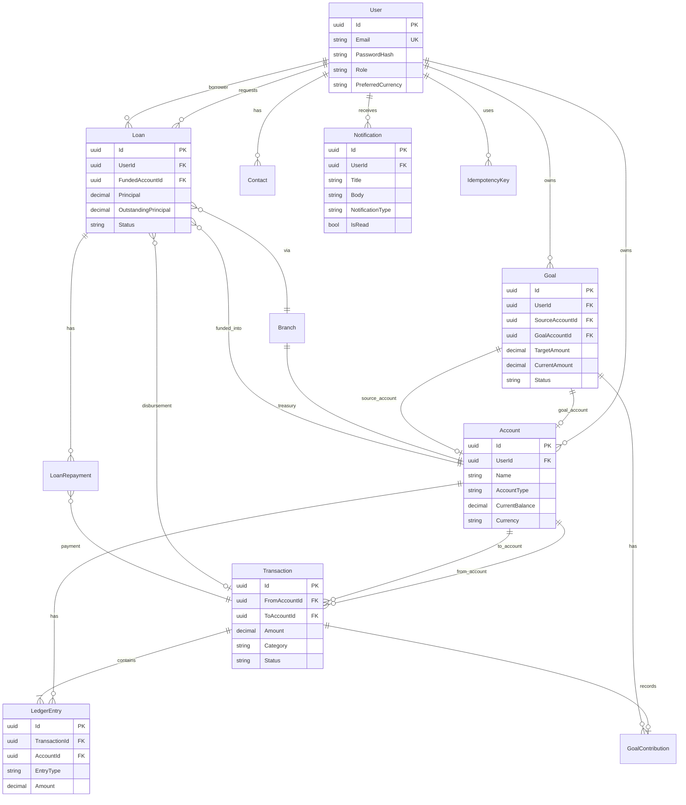

# Entity relationship diagram

Core domain model for **Current**. All monetary movement flows through `Transaction` + `LedgerEntry`.

## High-level ERD

## Entity summary

| Entity | Purpose |
|--------|---------|
| **User** | Registered user; auth, profile, preferences, role (`User` / `Admin`) |
| **Account** | User wallet (Everyday, Savings, Investment); holds balance |
| **Transaction** | Money movement record between two accounts |
| **LedgerEntry** | Debit or credit line tied to a transaction (double-entry) |
| **Goal** | Savings target with linked goal account |
| **GoalContribution** | Deposit or withdrawal against a goal |
| **Contact** | Saved payee (name + email) |
| **IdempotencyKey** | Dedupes payment requests per user |
| **Branch** | System branch (Current HQ) with treasury account |
| **Loan** | User loan request → approval → active repayment lifecycle |
| **LoanRepayment** | Payment applied against loan principal/interest |
| **Notification** | In-app alerts (security, payments, system) |

## Ledger invariant

For every completed transfer or payment:

- Sum of **debits** = sum of **credits**
- `Transaction.Amount` matches each leg
- Account balances updated in the same DB transaction

## Branch / loans

- **Treasury** — seeded with system float; debited for welcome credits and approved loans
- **Welcome credit** — $2,500 on first user-created account (configurable in `Branch` options)
- **Loans** — pending → approved (treasury disbursement) → active → repaid / rejected / cancelled
